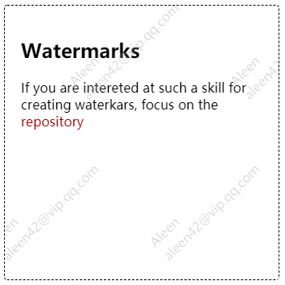

## watermarks-js

<p align="center"></p>

<p align="center"><a href="https://codepen.io/aleen42/pen/VNEmjQ" target="_blank"><strong>[Demo]</strong></a></p>

A JavaScript component for creating watermarks with web technologies supported above IE11+. For more details around browsers compatibilities, please check the document, ["Web skills for creating watermarks"](https://aleen42.github.io/PersonalWiki/post/create_watermarks_with_canvas/create_watermarks_with_canvas.html).

### Installation

```bash
npm i watermarks-js --save
```

### Usage

Use the component as a CommonJS module:

```js
const Watermarks = require('watermarks-js');
new Watermarks(document.createElement('div'), {
    contents: ['Aleen', 'aleen42@vip.qq.com'],
    watermarks: {
        region: { // control the position of watermarks
            x: 200,
            y:200,
            width: 100,
            height: 100,
        },
        align: 'left', // text-align (left by default)
        alpha: 0.2, // font-alpha (0.2 by default)
        fontSize: 16, // font-size (16 by default)
        fontRotate: Math.PI / 4, // font-rotate (-45° by default)
        lineHeightRatio: 1.5, // line-height (1.5x by default)
    },
});
```

Or directly used it in browsers as a script:

```html
<script type="text/javascript"
    src="https://github.com/aleen42/watermarks/releases/download/1.0.0/watermark.dist.js" />
```

```js
new Watermarks(document.createElement('div'), {
    contents: ['Aleen', 'aleen42@vip.qq.com'],   
});
```

### :fuelpump: How to contribute

Have an idea? Found a bug? See [how to contribute](https://aleen42.github.io/PersonalWiki/contribution.html).

### :scroll: License

[MIT](https://aleen42.github.io/PersonalWiki/MIT.html) © aleen42
