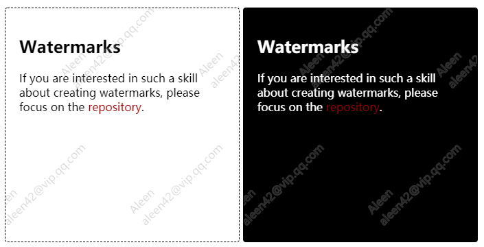

## watermarks-js

<p align="center"></p>

A JavaScript component for creating watermarks with web technologies supported above IE11+. For more details around browsers compatibilities, please check the document, ["Web skills for creating watermarks"](https://codepen.io/aleen42/pen/VNEmjQ).

### Installation

```bash
npm i watermarks-js --save
```

### Usage

Use the component as a CommonJS module:

```js
const Watermarks = require('watermarks-js');
new Watermarks($('<div>'), {
    contents: ['Aleen', 'aleen42@vip.qq.com'],   
});
```

Or directly used it in browsers as a script:

```html
<script type="text/javascript"
    src="https://github.com/aleen42/watermarks/releases/download/1.0.0/watermark.dist.js" />
```

```js
new Watermarks($('<div>'), {
    contents: ['Aleen', 'aleen42@vip.qq.com'],   
});
```

### :fuelpump: How to contribute

Have an idea? Found a bug? See [how to contribute](https://aleen42.github.io/PersonalWiki/contribution.html).

### :scroll: License

[MIT](https://aleen42.github.io/PersonalWiki/MIT.html) © aleen42
